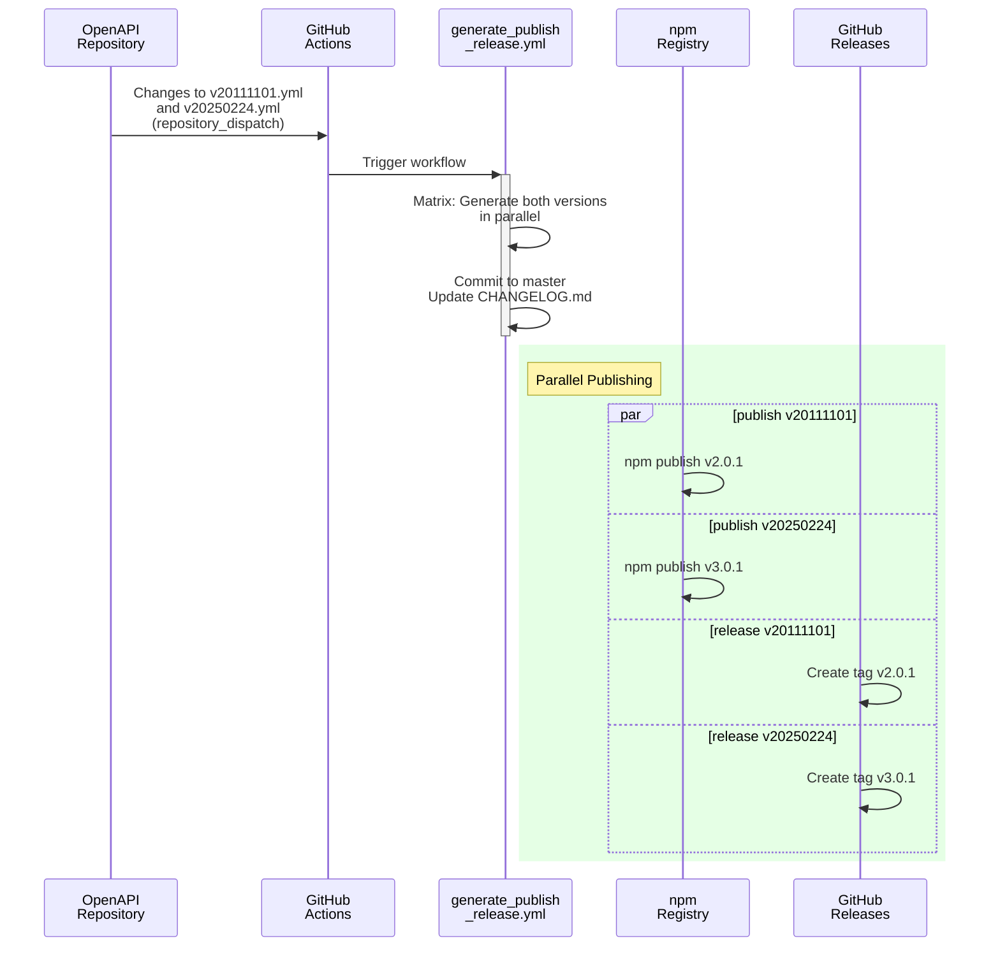
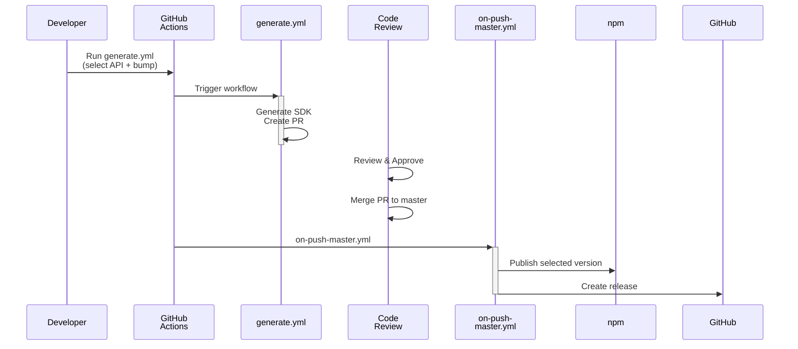
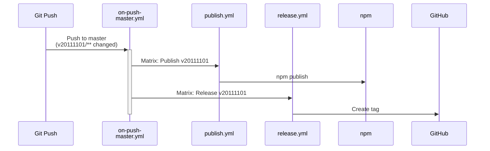

# Multi-Version SDK Flow - Quick Reference

**Document Purpose**: Quick-reference guide to the multi-version SDK generation, publishing, and release system. This is your entry point to understanding how the system works.

**Last Updated**: January 27, 2026  
**Read Time**: 5-10 minutes  
**Audience**: Anyone joining the team or needing a system overview

---

## What Is This?

The mx-platform-node repository publishes multiple API versions of the same npm package:
- `mx-platform-node@2.x.x` → API v20111101
- `mx-platform-node@3.x.x` → API v20250224

Each version is independently generated, tested, published to npm, and released on GitHub. The system is **automatic** (triggered by OpenAPI spec changes) and **manual** (triggered by developer workflows).

### Key Design Principles
1. **Separate Directories**: Each API version in its own directory (`v20111101/`, `v20250224/`)
2. **Reusable Workflows**: `workflow_call` passes version info to publish/release jobs
3. **One Config Per Version**: `config-v20111101.yml`, `config-v20250224.yml`, etc.
4. **Matrix Parallelization**: All versions generate/publish simultaneously
5. **Safety First**: Skip-publish flags and path-based triggers prevent accidents

---

## Three Ways Things Happen

### 🤖 Flow 1: Automatic (Upstream Triggers)
OpenAPI spec changes → `generate_publish_release.yml` runs → SDK generated, published, released

**When**: OpenAPI repository sends `repository_dispatch` with API versions  
**Who**: Automated, no human intervention  
**Result**: All specified versions generated in parallel, committed, published, released in single workflow

**Key Details**: See [Workflow-and-Configuration-Reference.md](Workflow-and-Configuration-Reference.md#flow-1-automatic-multi-version-generation-repository-dispatch)

### 👨‍💻 Flow 2: Manual (Developer Triggers)
Developer runs `generate.yml` → SDK generated → PR created → Developer merges → Auto-publish triggers

**When**: Developer clicks "Run workflow" on `generate.yml`  
**Who**: Developer (controls version selection and bump strategy)  
**Inputs**:
- `api_version`: Choose `v20111101` or `v20250224`
- `version_bump`: Choose `skip`, `minor`, or `patch`

**Result**: SDK generated in feature branch, PR created for review, auto-publishes on merge

**Key Details**: See [Workflow-and-Configuration-Reference.md](Workflow-and-Configuration-Reference.md#flow-2-manual-multi-version-generation-workflow-dispatch)

### 🔄 Flow 3: Auto-Publish (Master Push)
Changes pushed to `v20111101/**` or `v20250224/**` → `on-push-master.yml` runs → Publishes and releases

**When**: Any commit to master with version directory changes  
**Who**: Triggered automatically, can be skipped with `[skip-publish]` flag  
**Safety**: Only affected version(s) published (no cross-version interference)

**Key Details**: See [Workflow-and-Configuration-Reference.md](Workflow-and-Configuration-Reference.md#flow-3-auto-publish-trigger-with-path-based-matrix-execution-on-push-masteryml)

---

## Visual Flows

### Automatic Flow

### Manual Flow

### Auto-Publish Flow

---

## Common Tasks

### I Want to Add a New API Version
→ See [Adding-a-New-API-Version.md](Adding-a-New-API-Version.md)

**Quick summary**: Create config file → Update workflow matrix → Coordinate with OpenAPI repo

### Something Broke
→ See [Troubleshooting-Guide.md](Troubleshooting-Guide.md)

**Quick summary**: Check error message → Find section → Follow solution

### I Need Deep Technical Details
→ See [Workflow-and-Configuration-Reference.md](Workflow-and-Configuration-Reference.md)

**Covers**: Step-by-step implementation, configuration files, scripts, environment variables

---

## Key Files Reference

| File | Purpose | Used By |
|------|---------|---------|
| `.github/workflows/generate_publish_release.yml` | Automatic generation from upstream API changes | OpenAPI repo |
| `.github/workflows/generate.yml` | Manual generation with version selection | Developer |
| `.github/workflows/on-push-master.yml` | Auto-publish trigger with path-based matrix | Any master push |
| `.github/workflows/publish.yml` | Publishes SDK to npm | publish_release & on-push-master |
| `.github/workflows/release.yml` | Creates GitHub release | publish_release & on-push-master |
| `.github/version.rb` | Bumps version in config files | Workflows |
| `.github/clean.rb` | Removes old generated files | Workflows |
| `openapi/config-v20111101.yml` | Config for v20111101 generation | generate_publish_release & generate |
| `openapi/config-v20250224.yml` | Config for v20250224 generation | generate_publish_release & generate |
| `openapi/templates/package.mustache` | npm package.json template | OpenAPI Generator |
| `openapi/templates/README.mustache` | README.md template | OpenAPI Generator |

---

## Semantic Versioning

**Major version = API version** (no exceptions)

| npm Version | API Version | What It Means |
|------------|------------|--------------|
| 2.x.x | v20111101 | First stable API |
| 3.x.x | v20250224 | Second API version |
| 4.x.x | (future) | Next API version |

Consumers know exactly which API they have by checking the major version number.

---

## Backward Compatibility

If OpenAPI repo doesn't send new version in payload, the system doesn't break:
- Existing versions continue to work unchanged
- New version doesn't generate until explicitly requested
- No errors or warnings
- Phased rollout friendly

---

## Safety Features

| Feature | What It Does | When It Helps |
|---------|-------------|--------------|
| **Path-based triggers** | Only publish if `v20111101/**` or `v20250224/**` changed | Prevents false publishes from doc-only changes |
| **[skip-publish] flag** | Skip publish/release for this commit | During directory migrations or refactors |
| **Matrix conditionals** | Each version publishes only if its path changed | Prevents unintended version bumps |
| **Version validation** | Major version must match API version | Prevents semantic versioning violations |
| **Config file validation** | Workflow fails if config doesn't exist | Catches typos early |

---

## Environment Variables & Secrets

| Secret | Used For |
|--------|----------|
| `NPM_AUTH_TOKEN` | Publishing to npm registry |
| `GITHUB_TOKEN` | Creating releases (auto-provided) |
| `SLACK_WEBHOOK_URL` | Failure notifications |

---

## Next Steps

1. **Understand the architecture**: Read this document
2. **Need to add a version?**: Go to [Adding-a-New-API-Version.md](Adding-a-New-API-Version.md)
3. **Need to fix something?**: Go to [Troubleshooting-Guide.md](Troubleshooting-Guide.md)
4. **Need implementation details?**: Go to [Workflow-and-Configuration-Reference.md](Workflow-and-Configuration-Reference.md)

---

## Document Overview

| Document | Purpose | Read Time |
|----------|---------|-----------|
| **Multi-Version-SDK-Flow.md** | Overview & entry point (you are here) | 5-10 min |
| **Adding-a-New-API-Version.md** | Step-by-step guide for new versions | 10-15 min |
| **Troubleshooting-Guide.md** | Common issues & solutions | 5-10 min |
| **Workflow-and-Configuration-Reference.md** | Deep technical details | 20-30 min |
