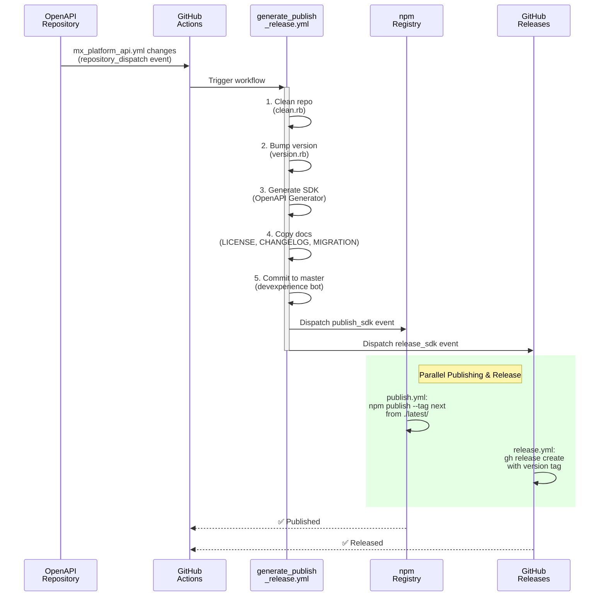
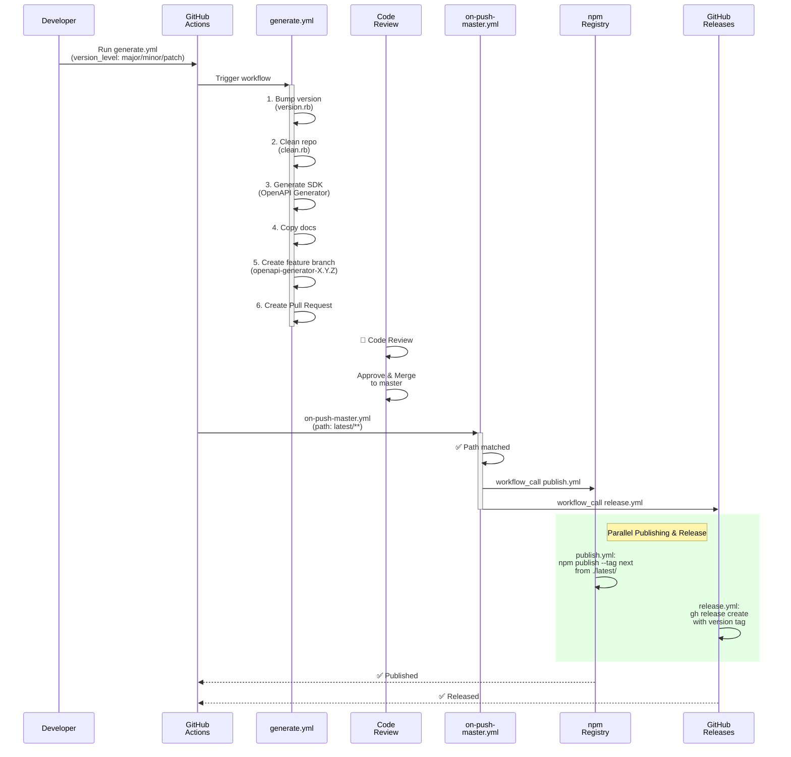

# SDK Generation, Publishing, and Release Flow (LEGACY - Single-Version)

> ⚠️ **ARCHIVED DOCUMENTATION** - This document describes the **single-version SDK system** that was in use before multi-version support was added. 
>
> **For current documentation**, see:
> - [Multi-Version-SDK-Flow.md](Multi-Version-SDK-Flow.md) - Current system overview
> - [Workflow-and-Configuration-Reference.md](Workflow-and-Configuration-Reference.md) - Current technical details
>
> This document is kept for **historical reference** and may be useful for repositories that have not yet migrated to multi-version support.

**Document Purpose**: This document explains how the Node.js SDK was automatically generated, published to npm, and released in the single-version system. It covers both automatic triggers (from the OpenAPI repository) and manual generation flows (for development and testing).

**Last Updated**: January 20, 2026 (ARCHIVED)  
**Repository**: mx-platform-node  
**Author**: DevExperience Team  
**Status**: Legacy - Superseded by multi-version flows

---

## Overview

The mx-platform-node repository has a fully automated pipeline for generating TypeScript SDKs from OpenAPI specifications, publishing them to npm, and creating releases on GitHub. The process is triggered in two ways:

1. **Automatic Flow** - When OpenAPI specifications change in the upstream `openapi` repository
2. **Manual Flow** - When developers manually trigger generation for development, testing, or version bumps

Both flows use the same underlying generation logic but differ in how they handle commits, publishing, and release creation.

---

## Flow 1: Automatic Generation (Repository Dispatch)

### Trigger
OpenAPI specifications in the upstream `openapi` repository change → Repository sends `repository_dispatch` event to `mx-platform-node` → `generate_publish_release.yml` workflow is triggered

### Current Implementation

**Workflow**: `.github/workflows/generate_publish_release.yml`

This is the **production flow** that automatically generates, publishes, and releases SDKs when upstream APIs change.

#### Step 1: Generate SDK from OpenAPI Spec
- **Input**: OpenAPI specification from `https://raw.githubusercontent.com/mxenabled/openapi/master/openapi/mx_platform_api.yml`
- **Output Directory**: `./latest/` 
- **Configuration**: Uses `./openapi/config.yml` to control generation settings
  - Package name: `mx-platform-node`
  - **Package version source**: `npmVersion` field in `./openapi/config.yml` (the source of truth)
  - **Version bump**: `client_payload.version` from repository dispatch (e.g., "patch", "minor") tells `version.rb` which component to increment
  - Flow: `client_payload.version` (bump instruction) → `version.rb` reads config → updates `npmVersion` in config → `package.mustache` uses updated `npmVersion` to create `package.json`
- **Templates**: Uses `./openapi/templates/` (package.mustache, README.mustache, etc.)
- **Process**:
  1. Clean repository using `clean.rb` (removes old generated files)
  2. Bump version: `version.rb` reads current `npmVersion` from config, increments based on `client_payload.version`, writes updated version back to config
  3. Run OpenAPI Generator to create TypeScript-Axios SDK (uses updated config with new `npmVersion`)
  4. Copy documentation files (LICENSE, CHANGELOG.md, MIGRATION.md) to generated directory

#### Step 2: Commit Changes to Master
- **Git Config**: Uses `devexperience` bot account
- **Commit Message**: `"Generated version X.Y.Z - This commit was automatically created by a GitHub Action..."`
- **Target Branch**: Directly commits to `master` (no PR created)

#### Step 3: Publish to npm
- **Trigger**: After successful commit, dispatches `publish_sdk` repository_dispatch event
- **Workflow**: `.github/workflows/publish.yml` (triggered via repository_dispatch)
- **Process**:
  1. Navigate to `./latest/` directory
  2. Install dependencies: `npm install`
  3. Publish to npm registry with `--tag next`
  4. Uses NPM_AUTH_TOKEN secret for authentication

#### Step 4: Create GitHub Release
- **Trigger**: After successful publish, dispatches `release_sdk` repository_dispatch event
- **Workflow**: `.github/workflows/release.yml` (triggered via repository_dispatch)
- **Process**:
  1. Read version from `./latest/package.json`
  2. Create GitHub release tagged with version (e.g., `v2.0.5`)
  3. Slack notification on failure

---

## Flow 2: Manual Generation (Workflow Dispatch)

### Trigger
Developer manually clicks "Run workflow" on `generate.yml` in GitHub Actions UI

### User Inputs
The workflow accepts two parameters:
- **version_level**: Which version component to bump (major, minor, or patch)
- Default: patch

### Current Implementation

**Workflow**: `.github/workflows/generate.yml`

This flow is used for:
- Development and testing
- Creating PRs with proposed SDK updates
- Manual version bumping before merging

#### Step 1: Version Bumping
- **Script**: `ruby .github/version.rb <version_level>`
- **Input File**: `./openapi/config.yml`
- **Process**: 
  1. Read current version from config file
  2. Increment major/minor/patch based on input
  3. Write updated version back to config file
  4. Output new version for next steps
- **Example**:
  - Current: 2.0.5 → Run with "minor" → New: 2.1.0

#### Step 2: Clean Repository
- **Script**: `ruby .github/clean.rb`
- **Process**:
  1. Delete all generated files from previous generation
  2. Protect certain directories from deletion (`.git`, `.github`, `openapi`, `LICENSE`, etc.)
  3. Keeps source configuration and workflow files intact

#### Step 3: Generate SDK
- **Input**: OpenAPI specification from `https://raw.githubusercontent.com/mxenabled/openapi/master/openapi/mx_platform_api.yml`
- **Output Directory**: `./latest/`
- **Configuration**: Uses `./openapi/config.yml`
- **Process**:
  1. Install OpenAPI Generator CLI globally
  2. Run generator with TypeScript-Axios language
  3. Copy documentation files to output directory

#### Step 4: Create Feature Branch
- **Branch Name**: `openapi-generator-X.Y.Z` (version from step 1)
- **Process**: 
  1. Create new branch from current checkout
  2. Stage all changes with `git add .`
  3. Commit with version number in message

#### Step 5: Create Pull Request
- **Command**: `gh pr create -f` (uses commit message for PR title/body)
- **Destination**: Targets default branch (master)
- **Review**: PR is created and awaits manual review + merge

#### Step 6: Trigger Publishing (After Merge)
- **Trigger**: When PR is merged to `master`, `on-push-master.yml` workflow activates
- **Condition**: Triggered only if files matching `latest/**` were modified
- **Workflows Called**: 
  1. `./.github/workflows/publish.yml` 
  2. `./.github/workflows/release.yml`
- **Result**: Same publishing and releasing as automatic flow

---


## Supporting Scripts

### version.rb
**Purpose**: Increment version numbers in configuration files

**Usage**: `ruby .github/version.rb <major|minor|patch> [config_file]`

**Important Nuance - npmVersion as Source of Truth**:

The `npmVersion` field in the config file is the **authoritative source of truth** for the package version. Here's how the version flows through the system:

1. **Config File** (Source of Truth)
   - `openapi/config.yml` contains `npmVersion: 2.0.0`
   - This is the persistent, stored version number
   - Lives in Git and is checked in with each update

2. **version.rb Script** (Updates Source of Truth)
   - Reads the current `npmVersion` from the config file
   - Receives bump instruction from caller: "patch", "minor", or "major"
   - Calculates new version: 2.0.0 → 2.0.1 (patch), 2.1.0 (minor), or 3.0.0 (major)
   - **Writes updated npmVersion back to config file** (persists to Git)
   - Outputs new version to stdout (for workflow logging)

3. **package.mustache Template** (Uses Source of Truth)
   - Contains placeholder: `"version": "{{npmVersion}}"`
   - OpenAPI Generator replaces `{{npmVersion}}` with value from config file
   - Generates `package.json` with the correct version number

4. **Result**
   - The generated `package.json` always has the correct version
   - Version comes entirely from the config file
   - No hardcoding in workflows or templates

**Important Distinction**:
- `client_payload.version` from repository_dispatch is a **bump instruction** (e.g., "patch")
- `npmVersion` in config file is the **actual version number** (e.g., "2.0.0")
- These are different things! The bump instruction is used to calculate the new version number.

**Behavior**:
- Reads YAML config file
- Parses current version (major.minor.patch)
- Increments requested component
- Resets lower components to 0 (e.g., 2.1.5 → 3.0.0 when major bumped)
- Writes updated config file
- Outputs new version to stdout

**Config File Parameter**: Optional, defaults to `./openapi/config.yml`

**Examples**:
```bash
ruby .github/version.rb patch                                    # Bumps config.yml patch version (2.0.0 → 2.0.1)
ruby .github/version.rb minor openapi/config-v20111101.yml     # Bumps config-v20111101 minor version (2.0.0 → 2.1.0)
ruby .github/version.rb major openapi/config-v20250224.yml     # Bumps config-v20250224 major version (3.0.0 → 4.0.0)
```

### clean.rb
**Purpose**: Remove generated SDK files before regeneration

**Behavior**:
- Walks through repository root directory
- Deletes all files/directories except those in ALLOW_LIST
- Protected directories: `.git`, `.github`, `.openapi-generator-ignore`, `openapi`, `LICENSE`, `README.md`, `CHANGELOG.md`, `MIGRATION.md`
- Prevents accidental deletion of configuration and workflow files

**Part 5 Note**: When multi-version support is activated, protected list will include: `v20111101`, `v20250224`, and remove `latest`

**Part 5 Note**: When multi-version support is activated, protected list will include: `v20111101`, `v20250224`, and remove `latest`

---

## Configuration Files

### openapi/config.yml

```yaml
---
generatorName: typescript-axios
npmName: mx-platform-node
npmVersion: 2.0.0
supportsES6: true
.openapi-generator-ignore: true
```

**Used by**: 
- `generate.yml` (manual generation)
- `generate_publish_release.yml` (automatic generation)
- `version.rb` script

### openapi/templates/
**Purpose**: Customized templates for package generation

**Files**:
- `package.mustache`: Controls package.json generation
  - **Key Feature**: Includes `"files"` field to explicitly control what gets published to npm
  - Controls package name, version, scripts, dependencies
- `README.mustache`: Controls README.md generation

---

## Path-Based Triggers

### on-push-master.yml
**Purpose**: Automatically trigger publish and release workflows when SDK code changes are pushed to master

```yaml
on:
  push:
    branches: [master]
    paths:
      - 'latest/**'    # Only trigger on changes in the latest/ directory
```

**This prevents**:
- Enhancement PRs (docs only) from triggering publish
- README updates from triggering releases
- Workflow file changes from triggering publish

---

## Workflow Sequences

The following sequence diagrams show the timeline and interactions for each flow, making it clear when workflows trigger and what happens at each stage.

### Flow 1: Automatic Generation (Repository Dispatch)



### Flow 2: Manual Generation (Workflow Dispatch)



---

---

## Environment Variables & Secrets Used

### Required Secrets (`.github/secrets`)

| Secret | Used In | Purpose |
|--------|---------|---------|
| `NPM_AUTH_TOKEN` | publish.yml | Authenticate to npm registry for publishing |
| `GITHUB_TOKEN` | All workflows | GitHub API access (auto-provided, but sometimes explicitly referenced) |
| `SLACK_WEBHOOK_URL` | All workflows | Send failure notifications to Slack |
| `PAPI_SDK_APP_ID` | generate_publish_release.yml | GitHub App ID for custom token generation |
| `PAPI_SDK_INSTALLATION_ID` | generate_publish_release.yml | GitHub App installation ID |
| `PAPI_SDK_PRIVATE_KEY` | generate_publish_release.yml | GitHub App private key |

### Environment Setup

- **Node**: v20.x
- **Ruby**: 3.1
- **OpenAPI Generator**: Latest version (installed via npm during workflow)

---

## Current Implementation Status

### ✅ Fully Implemented
- Automatic generation from OpenAPI spec changes (Flow 1)
- Manual generation for PRs with version bumping (Flow 2)
- Path-based triggers for publish/release
- npm publishing with semantic versioning
- GitHub releases
- Slack notifications
- v2.0.0 stable release confirmed

### Key Architectural Decisions

1. **Direct Commit vs PR**: 
   - Automatic flow (Flow 1) commits directly to master
   - Manual flow (Flow 2) creates PR for review
   
2. **Tag Strategy**: 
   - `--tag next`: Used during auto-publish (for staging validation)
   - Can be promoted to `latest` tag after validation

3. **Path-Based Triggers**: Only changes to SDK code (`latest/**`) trigger publish/release, not docs or workflows

4. **Atomic Operations**: Publishing and releasing happen in sequence within same workflow, preventing version mismatches

---

## Troubleshooting

### NPM Publish Fails
- Check `NPM_AUTH_TOKEN` secret is valid
- Verify token has publish permissions for `mx-platform-node` package
- Check version isn't already published

### Release Creation Fails
- Verify `GITHUB_TOKEN` has release creation permissions
- Check if tag already exists (gh release fails if tag exists)

### Generation Produces No Changes
- Verify OpenAPI spec URL is accessible
- Check openapi-generator-cli installed correctly
- Verify config file exists and is valid YAML

### publish.yml or release.yml Don't Trigger After Generate
- Check path filter in `on-push-master.yml` matches changed files
- Verify files were actually committed (`git log` to confirm)
- Check branch is `master` and not another branch

---
